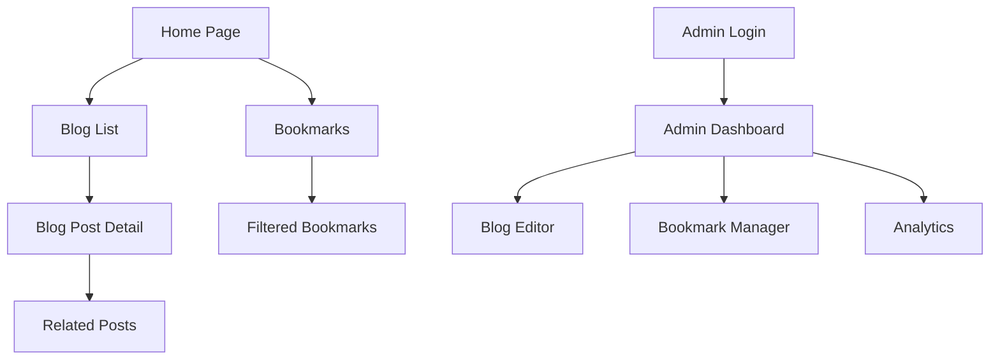

# Supabase Blog & Bookmarks Migration - Technical Implementation Plan

## 1. Product Overview

This document outlines the comprehensive migration plan for transforming the existing React TypeScript portfolio application from a static JSON-based bookmarks system to a dynamic Supabase-powered content management system with blog functionality and admin dashboard.

The implementation will maintain the existing high-quality user experience while adding powerful content management capabilities, user authentication, and real-time data synchronization through Supabase's Backend-as-a-Service platform.

## 2. Core Features

### 2.1 User Roles

| Role | Registration Method | Core Permissions |
|------|---------------------|------------------|
| Anonymous User | No registration required | Can browse published blog posts and bookmarks |
| Admin User | Email registration with admin role assignment | Full CRUD access to blogs, bookmarks, categories, and analytics |

### 2.2 Feature Module

Our enhanced portfolio application consists of the following main pages:

1. **Blog List Page**: Featured posts, category filtering, search functionality, pagination
2. **Blog Post Detail Page**: Full article content, reading time, related posts, analytics tracking
3. **Admin Dashboard**: Content management interface, rich text editor, analytics overview
4. **Enhanced Bookmarks Page**: Database-driven bookmarks with advanced filtering and categorization
5. **Authentication Pages**: Login, registration, and profile management

### 2.3 Page Details

| Page Name | Module Name | Feature Description |
|-----------|-------------|---------------------|
| Blog List | Hero Section | Display featured blog posts with category-based filtering and search |
| Blog List | Posts Grid | Paginated list of published posts with excerpt, reading time, and metadata |
| Blog Detail | Article Content | Full blog post with rich text content, syntax highlighting, and social sharing |
| Blog Detail | Related Posts | Algorithm-based related content suggestions |
| Admin Dashboard | Content Editor | Rich text editor with image upload, draft management, and publishing workflow |
| Admin Dashboard | Analytics Panel | View counts, popular posts, and engagement metrics |
| Enhanced Bookmarks | Dynamic Filtering | Real-time filtering by category, tags, difficulty, and read status |
| Enhanced Bookmarks | Admin Management | CRUD operations for bookmarks with bulk import/export capabilities |
| Authentication | Login/Register | Email-based authentication with role-based access control |

## 3. Core Process

### Admin Content Management Flow
1. Admin logs in through authentication system
2. Accesses admin dashboard with content overview
3. Creates/edits blog posts using rich text editor
4. Manages bookmarks with CRUD operations
5. Reviews analytics and engagement metrics
6. Publishes content with SEO optimization

### Public User Experience Flow
1. User visits blog list page with featured content
2. Filters and searches for relevant posts
3. Reads full articles with enhanced reading experience
4. Explores bookmarks with advanced filtering
5. Discovers related content through recommendations

## 4. User Interface Design

### 4.1 Design Style
- **Primary Colors**: Maintain existing brand colors with enhanced contrast ratios
- **Typography**: Existing font stack with improved readability for long-form content
- **Button Style**: Consistent with current design system, enhanced for admin actions
- **Layout Style**: Card-based design with improved spacing for content-heavy pages
- **Rich Text Editor**: Clean, distraction-free interface with essential formatting tools
- **Admin Interface**: Professional dashboard aesthetic with clear navigation and data visualization

### 4.2 Page Design Overview

| Page Name | Module Name | UI Elements |
|-----------|-------------|-------------|
| Blog List | Featured Posts | Hero cards with gradient overlays, category badges, reading time indicators |
| Blog Detail | Article Content | Typography-focused layout with table of contents, progress indicator, social sharing |
| Admin Dashboard | Content Management | Sidebar navigation, data tables with sorting/filtering, modal dialogs for editing |
| Enhanced Bookmarks | Filter Panel | Collapsible sidebar with multi-select filters, search autocomplete, tag cloud |

### 4.3 Responsiveness
The application maintains mobile-first responsive design with touch-optimized interactions for admin functionality. The rich text editor adapts to smaller screens with a simplified toolbar interface.