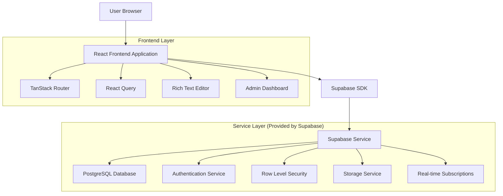
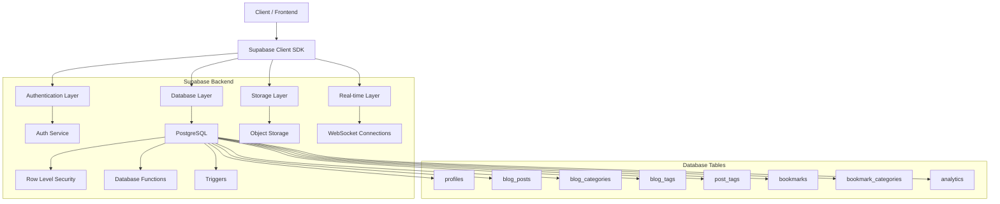
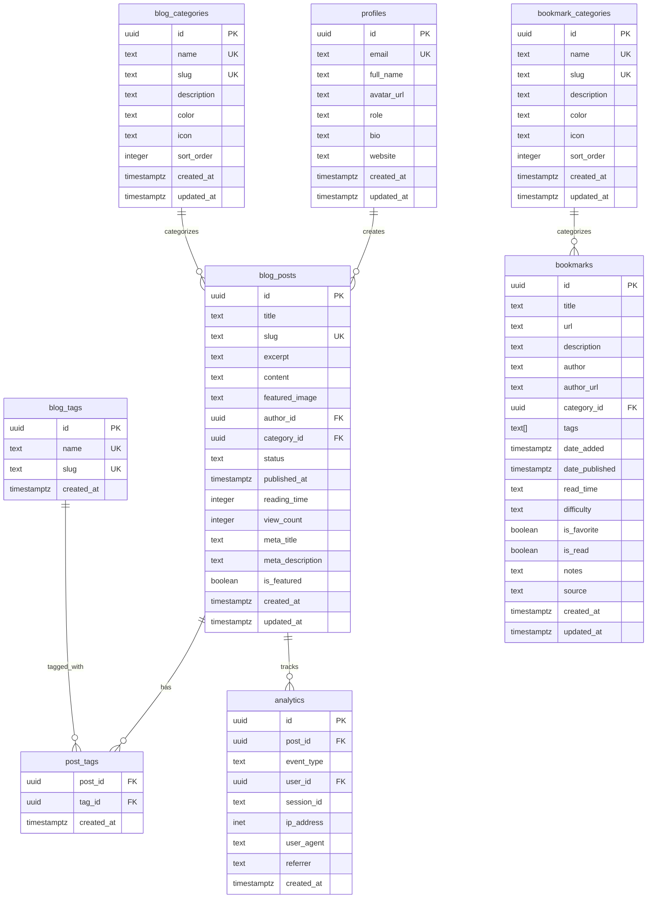

# Supabase Blog & Bookmarks - Technical Architecture Document

## 1. Architecture Design



## 2. Technology Description

- **Frontend**: React@18 + TypeScript + TanStack Router + Vite
- **UI Framework**: Tailwind CSS + Radix UI + Framer Motion
- **State Management**: React Query + Zustand (for complex state)
- **Rich Text Editor**: Tiptap with extensions for images and links
- **Backend**: Supabase (PostgreSQL + Authentication + Storage + Real-time)
- **Form Handling**: React Hook Form + Zod validation
- **Date Handling**: date-fns
- **Icons**: Lucide React

## 3. Route Definitions

| Route | Purpose |
|-------|---------|
| / | Home page with hero section and featured content |
| /blog | Blog list page with filtering and search |
| /blog/:slug | Individual blog post detail page |
| /bookmarks | Enhanced bookmarks page with database integration |
| /admin | Admin dashboard (protected route) |
| /admin/blog | Blog management interface |
| /admin/blog/new | Create new blog post |
| /admin/blog/:id/edit | Edit existing blog post |
| /admin/bookmarks | Bookmark management interface |
| /admin/analytics | Analytics and insights dashboard |
| /login | Authentication login page |
| /register | User registration page |

## 4. API Definitions

### 4.1 Core API

**Blog Posts Management**
```typescript
// Get published blog posts
GET /api/blog/posts
Query Parameters:
- page?: number
- limit?: number
- category?: string
- search?: string
- featured?: boolean

Response:
{
  data: BlogPost[],
  pagination: {
    page: number,
    limit: number,
    total: number,
    totalPages: number
  }
}
```

**Authentication**
```typescript
// Login user
POST /api/auth/login
Request:
{
  email: string,
  password: string
}

Response:
{
  user: User,
  session: Session,
  profile: Profile
}
```

**Bookmark Management**
```typescript
// Get bookmarks with filtering
GET /api/bookmarks
Query Parameters:
- category?: string
- tags?: string[]
- difficulty?: 'beginner' | 'intermediate' | 'advanced'
- favorites?: boolean

Response:
{
  data: Bookmark[],
  categories: BookmarkCategory[],
  totalCount: number
}
```

### 4.2 TypeScript Interfaces

```typescript
interface BlogPost {
  id: string;
  title: string;
  slug: string;
  excerpt: string;
  content: string;
  featured_image?: string;
  author_id: string;
  category_id?: string;
  status: 'draft' | 'published' | 'archived';
  published_at?: string;
  reading_time: number;
  view_count: number;
  meta_title?: string;
  meta_description?: string;
  is_featured: boolean;
  created_at: string;
  updated_at: string;
  author: Profile;
  category?: BlogCategory;
  tags: BlogTag[];
}

interface Bookmark {
  id: string;
  title: string;
  url: string;
  description?: string;
  author?: string;
  author_url?: string;
  category_id?: string;
  tags: string[];
  date_added: string;
  date_published?: string;
  read_time?: string;
  difficulty?: 'beginner' | 'intermediate' | 'advanced';
  is_favorite: boolean;
  is_read: boolean;
  notes?: string;
  source?: string;
  category?: BookmarkCategory;
}

interface Profile {
  id: string;
  email: string;
  full_name?: string;
  avatar_url?: string;
  role: 'user' | 'admin';
  bio?: string;
  website?: string;
  created_at: string;
  updated_at: string;
}
```

## 5. Server Architecture Diagram



## 6. Data Model

### 6.1 Data Model Definition



### 6.2 Data Definition Language

**Core Tables Creation**

```sql
-- Enable UUID extension
CREATE EXTENSION IF NOT EXISTS "uuid-ossp";

-- Profiles table (extends auth.users)
CREATE TABLE public.profiles (
    id UUID REFERENCES auth.users ON DELETE CASCADE PRIMARY KEY,
    email TEXT UNIQUE NOT NULL,
    full_name TEXT,
    avatar_url TEXT,
    role TEXT DEFAULT 'user' CHECK (role IN ('user', 'admin')),
    bio TEXT,
    website TEXT,
    created_at TIMESTAMP WITH TIME ZONE DEFAULT NOW(),
    updated_at TIMESTAMP WITH TIME ZONE DEFAULT NOW()
);

-- Blog categories
CREATE TABLE public.blog_categories (
    id UUID DEFAULT uuid_generate_v4() PRIMARY KEY,
    name TEXT UNIQUE NOT NULL,
    slug TEXT UNIQUE NOT NULL,
    description TEXT,
    color TEXT DEFAULT '#3B82F6',
    icon TEXT,
    sort_order INTEGER DEFAULT 0,
    created_at TIMESTAMP WITH TIME ZONE DEFAULT NOW(),
    updated_at TIMESTAMP WITH TIME ZONE DEFAULT NOW()
);

-- Blog tags
CREATE TABLE public.blog_tags (
    id UUID DEFAULT uuid_generate_v4() PRIMARY KEY,
    name TEXT UNIQUE NOT NULL,
    slug TEXT UNIQUE NOT NULL,
    created_at TIMESTAMP WITH TIME ZONE DEFAULT NOW()
);

-- Blog posts
CREATE TABLE public.blog_posts (
    id UUID DEFAULT uuid_generate_v4() PRIMARY KEY,
    title TEXT NOT NULL,
    slug TEXT UNIQUE NOT NULL,
    excerpt TEXT,
    content TEXT NOT NULL,
    featured_image TEXT,
    author_id UUID REFERENCES public.profiles(id) ON DELETE SET NULL,
    category_id UUID REFERENCES public.blog_categories(id) ON DELETE SET NULL,
    status TEXT DEFAULT 'draft' CHECK (status IN ('draft', 'published', 'archived')),
    published_at TIMESTAMP WITH TIME ZONE,
    reading_time INTEGER,
    view_count INTEGER DEFAULT 0,
    meta_title TEXT,
    meta_description TEXT,
    is_featured BOOLEAN DEFAULT FALSE,
    created_at TIMESTAMP WITH TIME ZONE DEFAULT NOW(),
    updated_at TIMESTAMP WITH TIME ZONE DEFAULT NOW()
);

-- Post tags junction table
CREATE TABLE public.post_tags (
    post_id UUID REFERENCES public.blog_posts(id) ON DELETE CASCADE,
    tag_id UUID REFERENCES public.blog_tags(id) ON DELETE CASCADE,
    created_at TIMESTAMP WITH TIME ZONE DEFAULT NOW(),
    PRIMARY KEY (post_id, tag_id)
);

-- Bookmark categories
CREATE TABLE public.bookmark_categories (
    id UUID DEFAULT uuid_generate_v4() PRIMARY KEY,
    name TEXT UNIQUE NOT NULL,
    slug TEXT UNIQUE NOT NULL,
    description TEXT,
    color TEXT DEFAULT '#3B82F6',
    icon TEXT,
    sort_order INTEGER DEFAULT 0,
    created_at TIMESTAMP WITH TIME ZONE DEFAULT NOW(),
    updated_at TIMESTAMP WITH TIME ZONE DEFAULT NOW()
);

-- Bookmarks
CREATE TABLE public.bookmarks (
    id UUID DEFAULT uuid_generate_v4() PRIMARY KEY,
    title TEXT NOT NULL,
    url TEXT NOT NULL,
    description TEXT,
    author TEXT,
    author_url TEXT,
    category_id UUID REFERENCES public.bookmark_categories(id) ON DELETE SET NULL,
    tags TEXT[] DEFAULT ARRAY[]::TEXT[],
    date_added TIMESTAMP WITH TIME ZONE DEFAULT NOW(),
    date_published TIMESTAMP WITH TIME ZONE,
    read_time TEXT,
    difficulty TEXT CHECK (difficulty IN ('beginner', 'intermediate', 'advanced')),
    is_favorite BOOLEAN DEFAULT FALSE,
    is_read BOOLEAN DEFAULT FALSE,
    notes TEXT,
    source TEXT,
    created_at TIMESTAMP WITH TIME ZONE DEFAULT NOW(),
    updated_at TIMESTAMP WITH TIME ZONE DEFAULT NOW()
);

-- Analytics
CREATE TABLE public.analytics (
    id UUID DEFAULT uuid_generate_v4() PRIMARY KEY,
    post_id UUID REFERENCES public.blog_posts(id) ON DELETE CASCADE,
    event_type TEXT NOT NULL CHECK (event_type IN ('view', 'like', 'share')),
    user_id UUID REFERENCES auth.users ON DELETE SET NULL,
    session_id TEXT,
    ip_address INET,
    user_agent TEXT,
    referrer TEXT,
    created_at TIMESTAMP WITH TIME ZONE DEFAULT NOW()
);

-- Performance indexes
CREATE INDEX idx_blog_posts_slug ON blog_posts(slug);
CREATE INDEX idx_blog_posts_status ON blog_posts(status);
CREATE INDEX idx_blog_posts_published_at ON blog_posts(published_at DESC);
CREATE INDEX idx_blog_posts_author ON blog_posts(author_id);
CREATE INDEX idx_blog_posts_category ON blog_posts(category_id);
CREATE INDEX idx_bookmarks_category ON bookmarks(category_id);
CREATE INDEX idx_bookmarks_tags ON bookmarks USING GIN(tags);
CREATE INDEX idx_analytics_post ON analytics(post_id);
CREATE INDEX idx_analytics_created ON analytics(created_at DESC);

-- Row Level Security policies
ALTER TABLE public.profiles ENABLE ROW LEVEL SECURITY;
ALTER TABLE public.blog_posts ENABLE ROW LEVEL SECURITY;
ALTER TABLE public.blog_categories ENABLE ROW LEVEL SECURITY;
ALTER TABLE public.blog_tags ENABLE ROW LEVEL SECURITY;
ALTER TABLE public.post_tags ENABLE ROW LEVEL SECURITY;
ALTER TABLE public.bookmarks ENABLE ROW LEVEL SECURITY;
ALTER TABLE public.bookmark_categories ENABLE ROW LEVEL SECURITY;
ALTER TABLE public.analytics ENABLE ROW LEVEL SECURITY;

-- Basic RLS policies
CREATE POLICY "Public profiles viewable by everyone" ON profiles FOR SELECT USING (true);
CREATE POLICY "Published posts viewable by everyone" ON blog_posts FOR SELECT USING (status = 'published');
CREATE POLICY "Categories viewable by everyone" ON blog_categories FOR SELECT USING (true);
CREATE POLICY "Tags viewable by everyone" ON blog_tags FOR SELECT USING (true);
CREATE POLICY "Post tags viewable by everyone" ON post_tags FOR SELECT USING (true);
CREATE POLICY "Bookmarks viewable by everyone" ON bookmarks FOR SELECT USING (true);
CREATE POLICY "Bookmark categories viewable by everyone" ON bookmark_categories FOR SELECT USING (true);

-- Admin-only policies
CREATE POLICY "Only admins can manage posts" ON blog_posts FOR ALL USING (
    EXISTS (SELECT 1 FROM profiles WHERE profiles.id = auth.uid() AND profiles.role = 'admin')
);

-- Seed data
INSERT INTO blog_categories (name, slug, description, color, icon) VALUES
    ('Technology', 'technology', 'Tech news and tutorials', '#3B82F6', '💻'),
    ('Career', 'career', 'Career advice and growth', '#10B981', '📈'),
    ('Tutorial', 'tutorial', 'Step-by-step guides', '#F59E0B', '📚');

INSERT INTO bookmark_categories (name, slug, description, color, icon) VALUES
    ('React & Frontend', 'react', 'React, Next.js, and modern frontend', '#61DAFB', '⚛️'),
    ('Software Architecture', 'architecture', 'System design and patterns', '#FF6B6B', '🏗️'),
    ('Performance', 'performance', 'Web performance optimization', '#4ECDC4', '⚡');
```